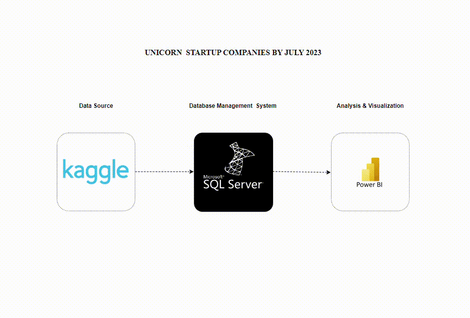

# UNICORN STARTUP COMPANIES ANALYSIS BY JULY 2023.

In business, a unicorn is a privately held startup company valued at over US$1 billion. 

[Wikipedia](https://en.wikipedia.org/wiki/Unicorn_(finance))

## Project Overview

## Problem Statement
The goal is to examine and comprehend the features of unicorn businesses as well as their impact on the global market. The objective is to find patterns, trends, and critical elements that lead to the success of unicorn startups in many industries. The report will assist stakeholders, investors, and entrepreneurs in making informed decisions about the unicorn startup ecosystem.

## Key Performance Indicators (KPIs)
1. Number of Unicorn Startups: Monitor the total number of unicorn startups over time to better understand the trend and pace of growth in the formation of billion-dollar firms.
2. Valuation Distribution: Analyze the valuation distribution among unicorn startups to determine the concentration of highly valued companies and their impact on the overall market.
3. Industry Breakdown : Exploration of the distribution of unicorn startups across different industries to determine which sectors are leading in the creation of billion-dollar firms.
4. Geographical Analysis: Examine the geographical distribution of unicorn startups to find regions or nations emerging as hotspots for successful startups.
5. Valuation Evolution: Investigate how the valuation of unicorn businesses has changed over time to gain a better understanding of the rate of growth and possible market trends.
6. Investor Analysis: Determine the most prevalent and significant investors who back unicorn businesses in order to assess the magnitude of their support and its possible impact on success.

## Data Source
The data used in the projects was obtained from [Kaggle](https://www.kaggle.com/datasets/ramjasmaurya/unicorn-startups)

## Tools 
- Power BI
- Microsoft SQL Server
  
## Skills and Concepts
* Data Cleaning
* Data Analysis
* Data Visualization
## Modelling

## Visualization
.jpg)

## Conclusion
* `ByteDance` was the highest valuated unicorn.
* The `Enterprise Tech` sector received the highest number of investments.
* The `Health & Life Sciences` sector is dominant in Europe.
* `Andreessen Horowitz` is the top investor and most of his inverstments were in `Enterprise Tech`.
* The year `2021` recorded the highest number of startups among all the listed years.
  
## Recommendations
- Investors should prioritize the `Enterprise Tech` sector for future investments, given its high number of investments.
- Investors should also diversify their portfolios across different sectors and regions to mitigate risks and enhance potential returns.
- Investors should also keep an eye on emerging markets and technologies within the `Enterprise Tech and Health & Life Sciences` sectors.
- Investors and incubators should enhance their support infrastructure, including mentorship, funding, and resources, to capitalize on this surge and nurture promising startups.

